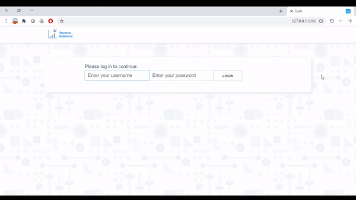

# Expenses DashBoard



This project started when my dad asked me to build software that would allow him to keep track of his credit expenses. <br>
He wanted to know how much money he spent each month by different industries.

## Features
- **Registration and login** <br>
For the purpose of registering and
  logging in to the site, I used the following open source : [dash-flask-login](https://github.com/RafaelMiquelino/dash-flask-login).<br>
  A relational database was used to save the username and password.<br>
  To keep passwords safe, werkzeug.security is used

- **Add and remove transaction** <br>
At this point the credit data is uploaded by uploading xls files. <br>
The further goal is for the software to automatically retrieve the data from the credit card company's website.

- **Display of expenses by sectors** <br>
To identify which sector each transaction belongs to I used Redis.<br>
I saved keywords and to which sector they belong.
When the software detects a transaction for the first time it checks if the keyword exists in the database. If not it does a Google search.

- **Data filtering** <br>
To pull the data from the database I used SQLAlchemy, for data processing I used In panda. <br>
For the realization of the resolution of tables and diagrams I used Dash


## Technologies
[Flask](https://github.com/pallets/flask) - Web framework <br>
[Dash](https://github.com/plotly/dash) - Python framework for building web analytic applications <br>
[Redis](https://github.com/redis/redis) - In-Memory Data Structure Store used for Business Sectors <br>
[SQLAlchemy](https://github.com/zzzeek/sqlalchemy) - Python SQL toolkit <br>
[Panda](https://github.com/pandas-dev/pandas) - Software library for data manipulation and analysis.<br>
[google-api](https://github.com/googleapis/google-api-python-client) - API to perform Google searches <br>
[dash-flask-login](https://github.com/RafaelMiquelino/dash-flask-login) - Dash application for users authentication


### Running an app locally

To run an app locally:

1. (optional) create and activate new virtualenv:

```
pip install virtualenv
virtualenv venv
source venv/bin/activate
```

2. `pip install -r requirements.txt`
3. `flask run`
4. open http://127.0.0.1:5000 in your browser or

